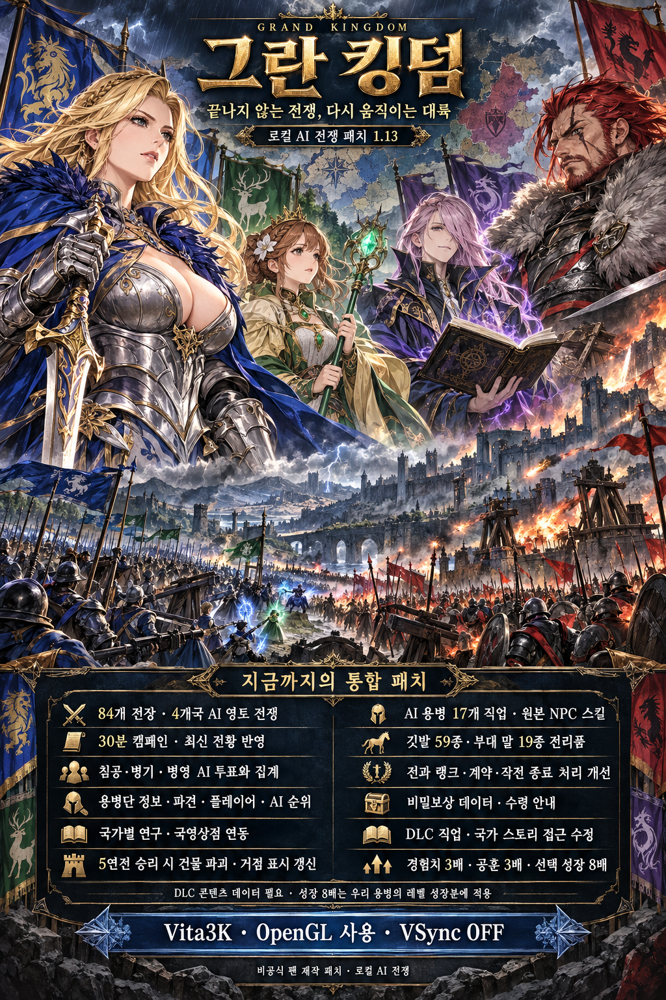

# 그란 킹덤 로컬 AI 전쟁 패치 1.13

**Grand Kingdom Local War 1.13** — Windows + Vita3K에서 네 국가의 AI 전쟁에 혼자 참가하는 비공식 팬 패치입니다. 일본판 **PCSG00474 / 게임 업데이트 1.06**용입니다.

네 군주의 전쟁을 표현한 최신 포스터입니다. 현재 배포 버전은 **1.13**이며 최신 변경점은 아래에 정리했습니다.

## 다운로드

- [최신 통합 배포본 1.13 받기](Grand_Kingdom_Local_War_1.13_Full_Distribution.zip?raw=true)
- [서버 소스·패치 제작 도구 1.13](grand-kingdom-local-war-source-1.13.zip?raw=true)
- [전체 한국어 설치 안내](README_KO.txt) · [변경 내역](CHANGELOG.md) · [파일 SHA-256](SHA256SUMS.txt)

설치 ZIP에는 실행 서버, 설치·갱신·진단·복원 도구와 전체 Source도 포함됩니다. 예전 1.5 파일과 릴리스는 이전 버전 기록입니다. 최신 설치에는 위 1.13 파일을 사용하세요.

## 1.13 변경점

| 항목 | 반영 내용 |
| --- | --- |
| AI 용병 행동 | 비어 있던 행동 스킬 슬롯을 원본 NPC의 직업별 스킬로 구성. 17개 직업에 적용하며 가능한 직업은 3가지 구성을 번갈아 사용합니다. |
| 거점 표시 | 오른쪽 위 거점 수·건물 HP 게이지가 최신 수신 전황을 읽도록 정기 화면 갱신 경로 수정. 84개 전장 공통입니다. |
| 깃발·부대 말 | 깃발 59종·말 19종의 원본 전리품 집계·소지품 저장 경로 검사. 확률은 깃발 7%, 말 1%이며 소유한 종류는 제외됩니다. 말은 탈것이 아닌 전장 부대 표시용 말입니다. |
| 비밀보상 | 1.12에서 보완한 국가별 보상 ID·원본 해금 조건 유지. 조건과 결과 보상 수령 안내 추가. |
| 기존 진행 | 일반 전장 보상량과 국가 계약·계약금 원본 계산, 경험치 3배·공훈치 3배·선택 성장 8배 유지. |

**갱신 후 전장에서 나갔다가 다시 참가하세요.** 이미 받은 적 후보는 새 스킬 편성으로 자동 교체되지 않습니다. 거점 표시는 서버의 최신 전황 수신 후 다음 화면 갱신에서 반영됩니다.

## 주요 기능과 누적 패치

- 네 국가의 AI 전쟁·영토 변화, 전체 84개 전장, 30분 캠페인.
- 국가 침공·전략 병기·병영 AI 투표, 용병단 정보·플레이어/AI 순위·전황 페이지.
- 4개국 항목별 연구·기부·국영상점 상품 연동. 1.5에서 갱신하면 새 연구 시스템 최초 시작 때 연구만 한 번 초기화됩니다.
- 요새·본진·병기 상대 각 승리마다 최대 HP 20% 감소, 총 5승에 파괴. 부분 승리 후 퇴각해도 피해를 유지하며 재전송은 중복 반영하지 않습니다.
- 작전별 공성·격파·지원 랭크, 실제 참가 용병단 인원 집계, 계약 기간의 캠페인 단위 계산 수정.
- AI 용병단 20개와 원본 NPC 10개의 적 후보 구성. 30개가 화면에 동시에 배치된다는 뜻은 아닙니다.
- 파견 1분당 1전투·최대 255전투, 전략지령 진영별 1회·작전 양측 합계 최대 2회.
- 정상 작전 종료·캠페인 교체 시 강제퇴각 처리 수정, 우리 용병 새 경험치 3배·새 작전 공훈치 3배.
- 선택 성장 8배는 우리 용병 HP·물리 공격·물리 방어·마법 공격의 레벨 성장분에 적용. 적/NPC 성장과 레벨 1 기본값은 유지합니다.
- DLC 직업·국가 스토리 접근 수정. 해당 콘텐츠 데이터는 별도로 필요합니다.

## 지원 환경과 설치

Windows + Vita3K / 일본판 PCSG00474 / 게임 업데이트 1.06. 최초 설치에는 해당 버전의 복호화 SELF eboot.bin이 필요합니다. **OpenGL 사용 / VSync OFF**로 설정하세요.

1. ZIP 전체를 전용 폴더에 압축 해제하고 Vita3K와 기존 GK 서버를 종료합니다.
2. `1_Install_Standard.cmd` 실행. 성장 8배를 선택하려면 `Optional_Growth_8x.cmd`를 사용합니다.
3. 설치된 `ux0/patch/PCSG00474/eboot.bin`(없으면 app 경로)과 복호화 `decrypted_selfs/PCSG00474/eboot.bin`을 각각 선택합니다.
4. INSTALLED 확인 후 `2_Start_Local_War.cmd`를 실행합니다.
5. SELFTEST OK / Finish 37 / READY 확인 후 게임의 온라인 메뉴로 접속합니다. 플레이 중 서버 창을 열어 두세요.

기존 사용자는 게임·서버 종료 → ZIP 전체를 **기존 패치 폴더에** 덮어 압축 해제 → `1_Update_Existing_Install.cmd` → `2_Start_Local_War.cmd` 순서입니다. 기존 설치 기록·계정·전황·protocol.dat·백업·세이브를 유지하세요. 성장 모드는 유지되며 정상 통신 테이블이 있으면 복호화 파일을 다시 요구하지 않습니다.

## 비밀보상 확인과 수령

1. 국가 계약 상태로 계약국이 참여하는 **같은 전장 지역**에서 적을 10회 격퇴합니다. 다른 지역의 격퇴 수를 단순 합산하는 조건은 아닙니다.
2. 계약국과 캠페인 결과 조건도 충족해야 합니다. 원본 판정에는 국가의 전장 승리 또는 필요한 전과 조건이 포함됩니다.
3. 캠페인 종료 후 온라인에 다시 접속해 **전쟁 결과·보상 처리를 완료**하세요. 해금 판정을 통과한 장비는 결과 보상 처리에서 소지품에 추가됩니다.
4. 입장 전 두루마리를 누르는 것만으로 지급되지 않습니다. 결과 처리 후에도 없으면 `4_Collect_Logs.cmd` 진단 ZIP과 결과 화면을 함께 제보하세요.

## 소스와 검증 범위

[소스 ZIP](grand-kingdom-local-war-source-1.13.zip?raw=true)의 `Source/server/`에 Go 서버, `Source/`에 네이티브 패치 제작·검증 도구가 있습니다. 소스 ZIP을 압축 해제한 뒤 실행하세요. Go 1.23 이상에서 `cd Source/server` → `go test ./...`로 기본 서버 검사를 실행합니다. [빌드 안내](BUILD.txt)를 참고하세요.

1.13 동봉 기록에는 기본 Go 검사·Linux 자체 검사·원본 NPC 스킬 출처, ARM 부대 해석 80개·실전 스킬 슬롯 1,028개·HUD 갱신 1,008개·깃발/말 78종 소지품 저장 경로 및 계약/랭크/HP 회귀 검사가 통과로 기록되어 있습니다. 일부 OS·통신·메모리 환경은 검증 도구에서 모델링했습니다. 과거 비공개 캡처가 없어 원본 프로토콜 전체 검사는 완료되지 않았습니다.

**실제 Windows 설치 UI 및 Vita3K 전투 행동·화면·사용자 세이브 저장·캠페인 비밀보상 수령은 추가 확인이 필요합니다.** 이번 GitHub 갱신에서는 최신 포스터를 반영하고 배포 ZIP의 압축 무결성과 동봉 147개 파일의 해시를 확인했습니다. 게임 패치와 서버 프로그램은 변경하지 않았습니다. ZIP 안의 일부 이전 홍보문에는 오래된 버전 번호가 남아 있으므로 버전은 release.json과 README_KO.txt를 기준으로 확인하세요.

게임 본편·업데이트·DLC 데이터·펌웨어·라이선스·개인 세이브는 포함하지 않습니다. 각 PC에서 독립된 로컬 AI 전황으로 동작하며 공용 멀티플레이·PS Vita 실기는 지원하지 않습니다. [재배포 안내](DISTRIBUTION.md)를 참고하세요.
